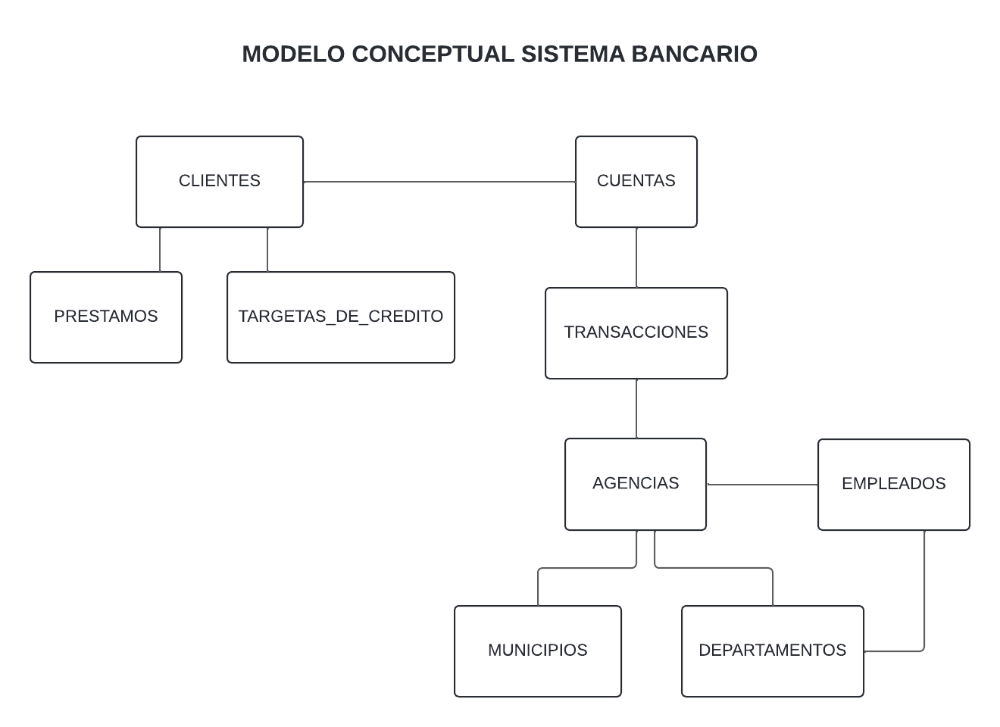
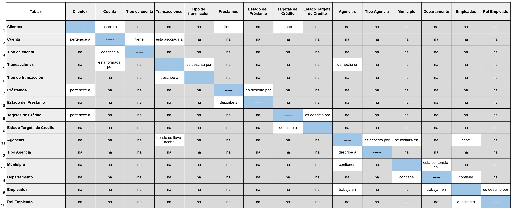
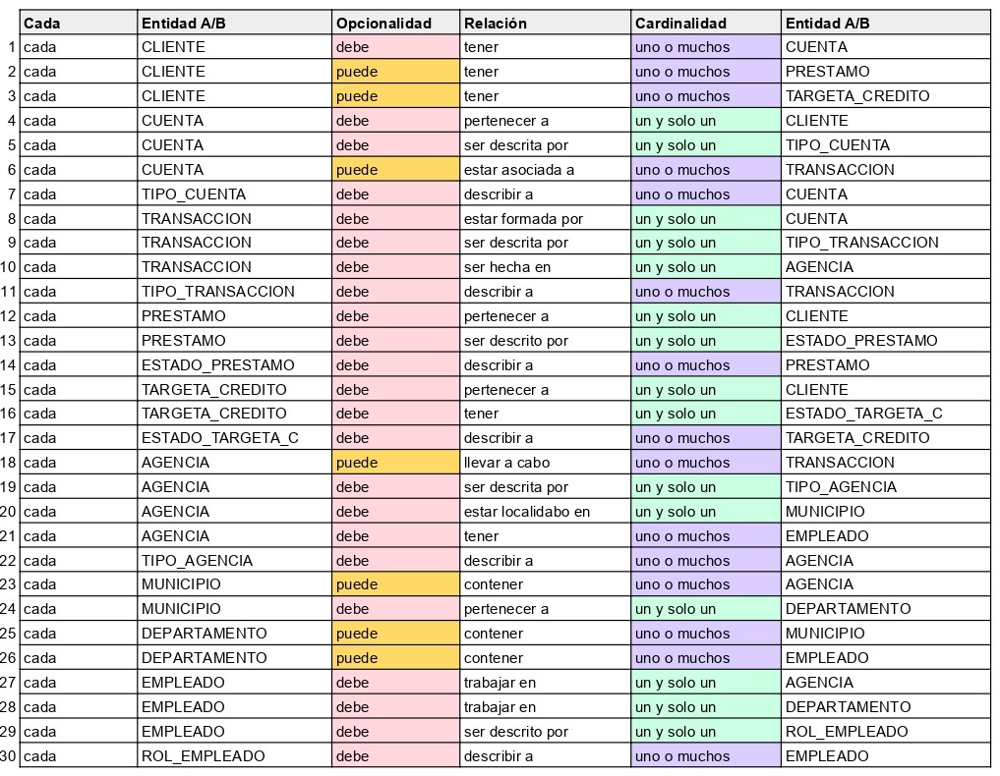
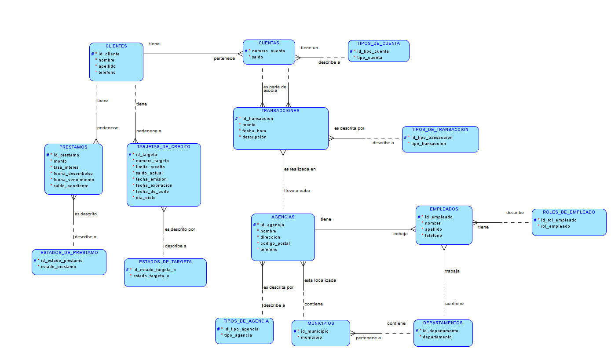
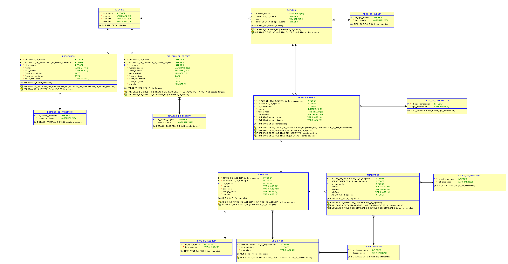

# Proyecto 1 - Sistema Bancario

## Descripción general

Este proyecto tiene como objetivo la creación, normalización y simulación de una base de datos para un sistema bancario, utilizando como fuente de datos varios archivos CSV que contienen información clave sobre los clientes, transacciones, préstamos, tarjetas de crédito, agencias y empleados. El proyecto se ha desarrollado utilizando **Oracle** como el Sistema de Gestión de Bases de Datos (DBMS), junto con diversas herramientas para el modelado y simulación de la base de datos.

## Herramientas Utilizadas

- **Oracle SQL Data Modeler**: Para el diseño y creación de los modelos lógico y físico.
- **Oracle DBMS**: Para la gestión de la base de datos.
- **Docker**: Para la simulación y manejo de contenedores en entornos de pruebas.
- **DataGrip**: Para la conexión, simulación e interacción con la base de datos.

---

## Tablas Generadas a partir de los CSV

Los datos provistos en los archivos CSV se estructuraron en diferentes tablas que reflejan las entidades clave del sistema bancario. Estos datos fueron obtenidos directamente de los archivos CSV sin cambios y se utilizaron para definir las siguientes tablas:

1. **Tabla Clientes**  
   Esta tabla contiene la información básica de los clientes, incluyendo su cuenta bancaria principal. Cada cliente está identificado de manera única por un ID. 

   | ID Cliente | Nombre | Apellido | Número de Cuenta | Tipo de Cuenta | Saldo | Teléfono |
   |------------|--------|----------|------------------|----------------|-------|----------|
   |------------|--------|----------|------------------|----------------|-------|----------|

---

2. **Tabla Transacciones**  
   Esta almacena todas las operaciones financieras realizadas por los clientes, especificando la cuenta de origen, la destino y el tipo de transacción.

   | ID Transacción | ID Cliente | Número de Cuenta | Tipo de Transacción | Monto | Fecha | Hora | Descripción | Agencia |
   |----------------|------------|------------------|---------------------|-------|-------|------|-------------|------------|
   |----------------|------------|------------------|---------------------|-------|-------|------|-------------|------------|

---

3. **Tabla Préstamos**  
   Esta tabla contiene información detallada sobre los préstamos otorgados a los clientes, incluyendo el monto, la tasa de interés y las fechas clave del préstamo.

   | ID Préstamo | ID Cliente | Monto del Préstamo | Tasa de Interés | Fecha de Desembolso | Fecha de Vencimiento | Saldo Pendiente | Estado del Préstamo |
   |-------------|------------|--------------------|-----------------|---------------------|----------------------|------------------|---------------------|
   |-------------|------------|--------------------|-----------------|---------------------|----------------------|------------------|---------------------|

---

4. **Tabla Tarjetas de Crédito**  
   Esta tabla almacena información sobre las tarjetas de crédito emitidas a los clientes, incluyendo detalles sobre el límite de crédito, el saldo actual y el estado de la tarjeta.

   | ID Tarjeta | ID Cliente | Número de Tarjeta | Límite de Crédito | Saldo Actual | Fecha de Emisión | Fecha de Expiración | Estado | Fecha de Corte | Día del Ciclo |
   |------------|------------|-------------------|-------------------|--------------|------------------|---------------------|--------|----------------|----------------|
   |------------|------------|-------------------|-------------------|--------------|------------------|---------------------|--------|----------------|----------------|

---

5. **Tabla Agencias**  
   Esta contiene la información detallada de las sucursales bancarias, incluyendo su ubicación y tipo de agencia.

   | ID Agencia | Nombre                    | Tipo de Agencia | Departamento | Municipio         | Dirección  | Código Postal | Teléfono        |
   |------------|---------------------------|-----------------|--------------|-------------------|------------|---------------|-----------------|
   | 1          | Sucursal Antigua Guatemala | Sucursal        | Sacatepéquez | Antigua Guatemala  | Zona 7     | 91405         | +502 8036-8423  |

---

6. **Tabla Empleados**  
   Esta tabla contiene información sobre los empleados que trabajan en las diferentes agencias bancarias, junto con su rol y asignación.

   | ID Empleado | Nombre | Apellido | ID Rol | Departamento | ID Agencia | Teléfono | Fecha de Contratación | Salario | Horario de Trabajo |
   |-------------|--------|----------|--------|--------------|------------|----------|-----------------------|---------|--------------------|
   |-------------|--------|----------|--------|--------------|------------|----------|-----------------------|---------|--------------------|

---

## Modelo Conceptual

Se identificaron las entidades clave del sistema bancario (Clientes, Cuentas, Transacciones, Préstamos, Tarjetas de Crédito, Agencias, Municipios, Departamentos y Empleados) a partir de los archivos CSV y se definieron sus relaciones de forma inicial. El modelo resultante se visualiza en el siguiente diagrama:

---

## Proceso de Normalización

### Primera Forma Normal (1FN)

La Primera Forma Normal elimina grupos repetidos en una tabla y se asegura de que cada columna contenga valores atómicos (es decir, no divididos o compuestos).
Las tablas que se vieron afectadas son las siguientes:

1. **Transacciones**  
   Se dividió el campo "Número de Cuenta" en dos campos: "Número de Cuenta Origen" y "Número de Cuenta Destino", ya que en el CSV original estos valores estaban combinados. La nueva estructura es la siguiente:

   | ID Transacción | ID Cliente | Número de Cuenta Origen | Número de Cuenta Destino | Tipo de Transacción | Monto | Fecha | Hora | Descripción | Agencia |
   | -------------- | ---------- | ----------------------- | ------------------------ | ------------------- | ----- | ----- | ---- | ----------- | ------ |
   | -------------- | ---------- | ----------------------- | ------------------------ | ------------------- | ----- | ----- | ---- | ----------- | ------ |

---

## Segunda Forma Normal (2FN) Y Tercera Forma Normal (3FN)

La Segunda Forma Normal se asegura que todas las columnas dependan completamente de la clave primaria, mientras que la Tercera Forma Normal se asegura que cada columna no clave debe dependa solo de la clave primaria y no de otras columnas no claves.

Estas formas de normalización fueron aplicadas en conjunto, ya que son complementarias y permiten estructurar mejor la base de datos, evitando redundancias y mejorando la integridad de los datos.

Las tablas que se vieron afectadas son las siguientes:

1. **Clientes**  
   Se separaron los datos de las cuentas en otra tabla, ya que un cliente puede tener múltiples cuentas. Además el tipo de cuenta fue aislado en otra tabla para optimizar el uso de memoria.  
   Nueva estructura de la tabla Clientes:

   | ID Cliente | Nombre | Apellido | Teléfono |
   | ---------- | ------ | -------- | -------- |
   | ---------- | ------ | -------- | -------- |

   **Nueva tabla: Cuentas**  
   Relaciona a los clientes con sus cuentas.  
   Estructura:

   | Número de Cuenta | ID Cliente | ID Tipo de Cuenta | Saldo |
   | ---------------- | ---------- | ----------------- | ----- |
   | ---------------- | ---------- | ----------------- | ----- |
    
   **Nueva tabla: Tipos de cuenta**  
   Almacena los diferentes tipos de cuenta.  
   Estructura:

   | ID Tipo de Cuenta | Tipo de cuenta |
   | -------------------- | ------ |
   | -------------------- | ------ |

2. **Transacciones**  
   Se eliminó el atributo "ID Cliente", ya que este se puede derivar a partir de las cuentas asociadas a las transacciones. Además el tipo de transacciòn fue aislado en otra tabla para optimizar el uso de memoria. 
   Nueva estructura de la tabla Transacciones:

   | ID Transacción | ID Cuenta Origen | ID Cuenta Destino | ID Tipo de Transacción | Monto | Fecha | Hora | Descripción | ID Agencia |
   | -------------- | ---------------- | ----------------- | ---------------------- | ----- | ----- | ---- | ----------- | ---------- |
   | -------------- | ---------------- | ----------------- | ---------------------- | ----- | ----- | ---- | ----------- | ---------- |

   **Nueva tabla: Tipos de Transaccion**  
   Almacena los diferentes tipos transaccion.  
   Estructura:

   | ID Tipo de Transacción | Tipo de Transacción |
   | -------------------- | ------ |
   | -------------------- | ------ |

3. **Préstamos**  
   Se creó una tabla separada para el "Estado del Préstamo", para evitar redundancias en la información.  
   Nueva estructura de la tabla Préstamos:

   | ID Préstamo | ID Cliente | Monto del Préstamo | Tasa de Interés | Fecha de Desembolso | Fecha de Vencimiento | Saldo Pendiente | ID Estado de Préstamo |
   | ----------- | ---------- | ------------------ | ---------------- | ------------------ | ------------------- | ---------------- | ---------------------- |
   | ----------- | ---------- | ------------------ | ---------------- | ------------------ | ------------------- | ---------------- | ---------------------- |

   **Nueva tabla: Estados de Préstamo**  
   Almacena los diferentes estados en los que puede estar un préstamo.  
   Estructura:

   | ID Estado de Préstamo | Estado de Préstamo |
   | -------------------- | ------ |
   | -------------------- | ------ |

4. **Tarjetas de Crédito**  
   Se separó el "Estado" de las tarjetas en una nueva tabla para optimizar la memoria.  
   Nueva estructura de la tabla Targetas de Crédito:

   | ID Tarjeta | ID Cliente | Número de Tarjeta | Límite de Crédito | Saldo Actual | Fecha de Emisión | Fecha de Expiración | ID Estado de Tarjeta | Fecha de Corte | Día del Ciclo |
   | ---------- | ---------- | ------------------ | ------------------ | ------------- | ------------------ | ------------------- | ------------------- | -------------- | -------------- |
   | ---------- | ---------- | ------------------ | ------------------ | ------------- | ------------------ | ------------------- | ------------------- | -------------- | -------------- |

   **Nueva tabla: Estado Tarjeta de Crédito**  
   Almacena los diferentes estados en los que puede estar una tarjeta de crédito.  
   Estructura:

   | ID Estado de Tarjeta | Estado de Tarjeta |
   | -------------------- | ------ |
   | -------------------- | ------ |

5. **Agencias**  
   Se separó el "Tipo" de agencia en una nueva tabla para mejorar la estructura. Además se introdujo una tabla para almacenar los municipios y se creó una tabla para almacenar los departamentos
   Nueva estructura de la tabla Agencias:

   | ID Agencia | Nombre | ID Tipo Agencia | ID Municipio | Dirección | Código Postal | Teléfono |
   | ---------- | ------ | ---------------- | ------------- | --------- | -------------- | -------- |
   | ---------- | ------ | ---------------- | ------------- | --------- | -------------- | -------- |

   **Nueva tabla: Tipos Agencia**  
   Almacena los diferentes tipos de agencias.  
   Estructura:

   | ID Tipo Agencia | Tipo Agencia |
   | --------------- | ------------ |
   | --------------- | ------------ |

   **Nueva tabla: Municipios**  
   Se introdujo una tabla para almacenar los municipios, optimizando la estructura.  
   Estructura:

   | ID Municipio | Municipio | ID Departamento |
   | ------------ | --------- | ---------------- |
   | ------------ | --------- | ---------------- |

   **Nueva tabla: Departamentos**  
   Almacena los departamentos.  
   Estructura:

   | ID Departamento | Departamento |
   | ---------------- | ------------ |
   | ---------------- | ------------ |

6. **Empleados**  
   Se separaron los departamentos y sucursales en diferentes tablas para mayor claridad y eficiencia.  
   Nueva estructura de la tabla Empleados:

   | ID Empleado | Nombre | Apellido | ID Rol | ID Departamento | ID Agencia | Teléfono |
   | ----------- | ------ | -------- | ------ | ---------------- | ---------- | -------- |
   | ----------- | ------ | -------- | ------ | ---------------- | ---------- | -------- |

   **Nueva tabla: Roles empleado**  
   Almacena los diferentes roles que puede desempeñar un empleado.  
   Estructura:

   | ID Rol | Rol |
   | --------------- | ------------ |
   | --------------- | ------------ |

## Diagrama Matricial

Se utilizó un **diagrama matricial** para identificar las relaciones entre nuestras 16 tablas resultantes. Este diagrama permite visualizar las conexiones entre las tablas de manera clara y organizada.

**Descripción de celdas**:
- **Celdas azules**: Relación inexistente.
- **Celdas grises**: Relación no aplicable.
- **Celdas blancas**: Relación existente.

---

## Relaciones entre tablas

Después de generar el diagrama matricial, se procedió a desglosar las 30 relaciones identificadas, detallando su **cardinalidad** y **opcionalidad**. Siguiendo el formato de Oracle " [Cada] [Entidad A/B]	[Opcionalidad]	[Relación] [Cardinalidad]	[Entidad A/B]".

### Relación Importante: No.8 **Transacción - Cuenta**

- Cada **Transacción** debe estar asociada a **una y solo una** **Cuenta**.

Cada entidad Transacción cuenta con dos registros de Cuenta, pero cada uno de estos registros se encuentra enlazado con una sola Cuenta, lo que hace que se forme una relación **"una y solo una"**. 

En la visión general de esta relación, como se verá más adelante, se crea una relación de uno a muchos entre Cuentas y Transacciones. Evitandose asì, una relación de muchos a muchos aunque La entidad Transacciòn cuente con más de un registro asociado a la entidad Cuenta

---

## Modelo Lógico

El modelo lógico fue implementado utilizando la notación de Barker, y representa la estructura de la base de datos con sus relaciones y cardinalidades obtenidas en el inciso anterior.

---

## Modelo Físico

El modelo físico detalla la implementación de la base de datos en **MySQL**, incluyendo la creación de tablas, índices, y restricciones de integridad referencial.

